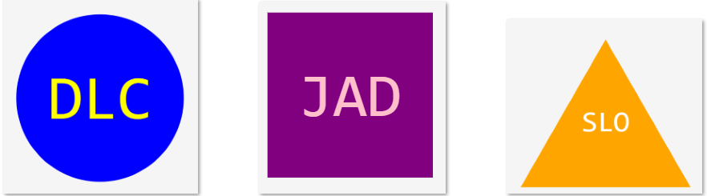

# svg-logo-maker

## Description

This application uses command line interface to get input from a user to generate an SVG file of a simple logo.  Users begin by making a choice of shape.  Then they input 1-3 characters as the text for their logo along with text color and background color. 

## Installation 

website can be accessed at: https://github.com/ddurmala/svg-logo-maker

## Usage

video link: https://drive.google.com/file/d/1-9GCXymCsOOzsxUKYR58uVpOXjT4ljwG/view?usp=sharing

## Testing

shapes.test.js tests the functionality of the application by passing values and ensuring the code will generate logos correctly. 

## Credits

coded and designed by Dana Castagna

© 2024 edX Boot Camps LLC.

## License
MIT License

Copyright (c) 2024 Dana Castagna

Permission is hereby granted, free of charge, to any person obtaining a copy
of this software and associated documentation files (the "Software"), to deal
in the Software without restriction, including without limitation the rights
to use, copy, modify, merge, publish, distribute, sublicense, and/or sell
copies of the Software, and to permit persons to whom the Software is
furnished to do so, subject to the following conditions:

The above copyright notice and this permission notice shall be included in all
copies or substantial portions of the Software.

THE SOFTWARE IS PROVIDED "AS IS", WITHOUT WARRANTY OF ANY KIND, EXPRESS OR
IMPLIED, INCLUDING BUT NOT LIMITED TO THE WARRANTIES OF MERCHANTABILITY,
FITNESS FOR A PARTICULAR PURPOSE AND NONINFRINGEMENT. IN NO EVENT SHALL THE
AUTHORS OR COPYRIGHT HOLDERS BE LIABLE FOR ANY CLAIM, DAMAGES OR OTHER
LIABILITY, WHETHER IN AN ACTION OF CONTRACT, TORT OR OTHERWISE, ARISING FROM,
OUT OF OR IN CONNECTION WITH THE SOFTWARE OR THE USE OR OTHER DEALINGS IN THE
SOFTWARE.

## Features

- generate a custom svg image file
- input text and choose colors
